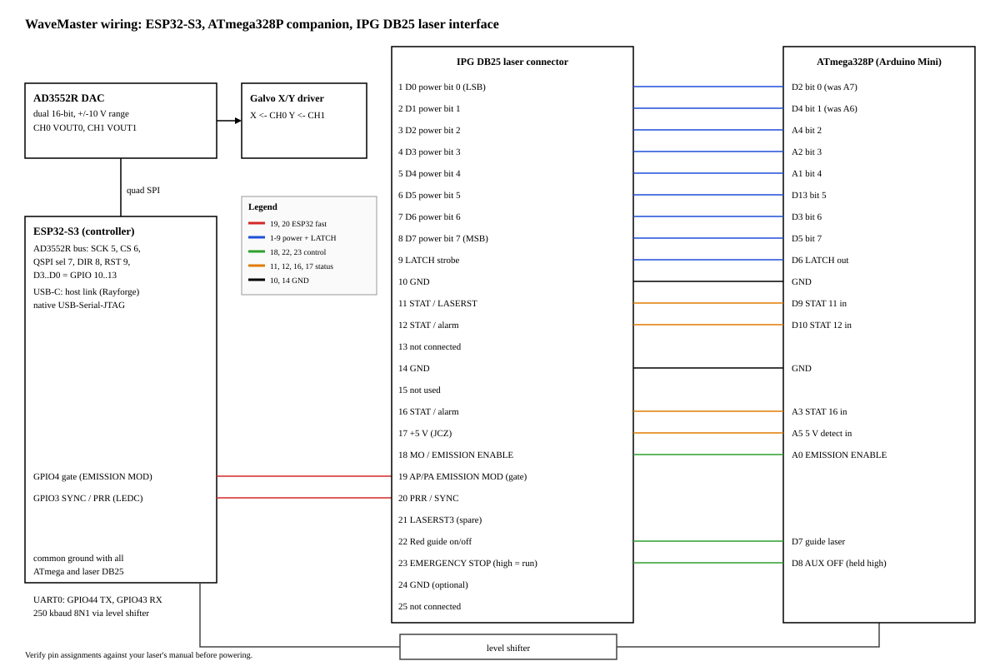

# WaveMaster wiring guide

This guide covers the wiring between the ESP32-S3 controller, the ATmega328P
companion, the IPG YLP laser interface (DB25), and the galvo drivers. It
replaces the previous pin assignment. The DB25 table below is the reference;
the diagram in [wiring.svg](wiring.svg) is a summary of it.



> **Safety:** do all rewiring with the laser powered off and disconnected.
> Check every pin against your laser's own manual before powering anything.
> The mapping below was cross-checked against the BJJCZ LMCV4-FIBER-M manual
> (CON2 table, https://ntjet.com/download/LMCV4-FIBER-M.pdf) and the SCANLAB
> RTC4-to-IPG cable document (https://solustan.com/images/support-pdffile/support_documents/IPGCable.pdf).

---

## 1. IPG YLP DB25 laser interface

Pin-to-pin ribbon/cable from the laser's DB25 to the controller boards.

| Pin | IPG/JCZ signal | Function | Connects to | Notes |
|:---:|:---|:---|:---|:---|
| 1 | D0 | Power bit 0 (LSB) | Arduino **D2** | Moved from A7. A6/A7 are analog-input-only on the ATmega328P and never drove the laser. |
| 2 | D1 | Power bit 1 | Arduino **D4** | Moved from A6 (same reason as pin 1). |
| 3 | D2 | Power bit 2 | Arduino A4 | |
| 4 | D3 | Power bit 3 | Arduino A2 | |
| 5 | D4 | Power bit 4 | Arduino A1 | |
| 6 | D5 | Power bit 5 | Arduino D13 | |
| 7 | D6 | Power bit 6 | Arduino D3 | |
| 8 | D7 | Power bit 7 (MSB) | Arduino D5 | |
| 9 | LATCH | Power latch strobe | Arduino D6 | Firmware: 2 us setup, 3 us strobe. |
| 10 | GND | Ground | Common ground | Arduino GND and ESP32 GND. |
| 11 | Alarm/status (LASERST) | Status input | Arduino D9 (STAT 11) | Read by the ATmega only. |
| 12 | Alarm/status | Status input | Arduino D10 (STAT 12) | Read by the ATmega only. |
| 13 | not connected | - | - | Some older IPG cable docs list 11-15 as ground; check your laser manual. |
| 14 | GND | Ground | Common ground | |
| 15 | not used | - | - | Some IPG docs: ground. |
| 16 | Alarm/status | Status input | Arduino A3 (STAT 16) | Read by the ATmega only. |
| 17 | +5 V | Supply (JCZ cards supply 5 V here) | Arduino A5 "5V DETECT" | Through the existing divider, if any. Firmware only reads it. |
| 18 | MO / EMISSION ENABLE ("arm") | Master oscillator enable | Arduino A0 | Driven by the ATmega (`M10` / `M11`). |
| 19 | AP/PA = EMISSION MODULATION | Fast laser gate | **ESP32 GPIO4** | Moved from Arduino D2. Add a **10 kOhm pull-down to GND**, so the laser cannot fire while the ESP32 resets. See the polarity warning in section 2. |
| 20 | PRR / SYNC | Pulse repetition rate clock | **ESP32 GPIO3** | Moved from Arduino D4. 10 kOhm pull-down to GND recommended. |
| 21 | Alarm/status (LASERST3) | Status | not connected | Spare. No firmware input yet. |
| 22 | Red guide pointer on/off | Guide laser | Arduino D7 | `M62` / `M63`; preview `M66` / `M67`. |
| 23 | EMERGENCY STOP | Must be HIGH for the laser to run | Arduino D8 "AUX OFF" | Held HIGH by the firmware. **Wire a real E-stop / interlock in series** per the IPG manual. The RTC4-to-IPG cable note says pin 23 is tied high only for initial testing. |
| 24 | GND | Optional extra ground (RTC4-IPG cable doc; JCZ: unconnected) | Common ground | Optional. |
| 25 | not connected | - | - | |

Wires that moved in the redesign (pins 1, 2, 19, 20) are the ones to check first.

---

## 2. ESP32-S3 pins

| ESP32-S3 GPIO | Signal | Connects to | Notes |
|:---:|:---|:---|:---|
| 4 | `LASER_IO_PIN_GATE` (EMISSION MODULATION) | DB25 pin 19 | Sample-locked gate, driven from the SPI ISR and a GPTimer. Active high by default (`$230=0`). |
| 3 | `LASER_IO_PIN_SYNC` (PRR) | DB25 pin 20 | LEDC square wave, rate from `$220`, duty from `$221`. |
| 44 | UART0 TX | Level shifter, then ATmega RX (D0) | 250000 baud 8N1. Pins are assigned by `uart_set_pin`, swapped from the IOMUX defaults. |
| 43 | UART0 RX | Level shifter, then ATmega TX (D1) | See above. |
| 5 | AD3552R SCK | AD3552R SCLK | |
| 6 | AD3552R CS | AD3552R CS | Held low across a whole streamed burst. |
| 7 | QSPI-mode select (`BOARD_PIN_SPI_OP1`) | AD3552R QSPI pin (pin 31) | Low = classic/dual SPI, high = quad. The firmware raises it only for streaming bursts. |
| 8 | DIR (`BOARD_PIN_DIR`) | Level-shifter direction | Single shared DIR line for the data lanes. |
| 9 | RST (`BOARD_PIN_RST`) | AD3552R RESET | |
| 10 | D3 (`BOARD_PIN_D3`) | AD3552R data lane 3 | QSPI |
| 11 | D2 (`BOARD_PIN_D2`) | AD3552R data lane 2 | QSPI |
| 12 | D1 (`BOARD_PIN_D1`) | AD3552R data lane 1 | QSPI / SDO |
| 13 | D0 (`BOARD_PIN_D0`) | AD3552R data lane 0 | QSPI / SDI |
| native USB | USB-Serial-JTAG | PC (Rayforge) | Host link: GRBL text in, `[MSG:...]` logs out. The baud setting does not matter for this port. |
| GND | Common ground | Arduino, level shifter, laser DB25 pin 10 / 14 | Grounds must be common. |

**Gate polarity warning.** The 10 kOhm pull-down on DB25 pin 19 keeps the
laser off while the ESP32 is in reset only while the gate is active high
(`$230=0`). If `$230=1` (active low), the same pull-down holds the gate
**active**. Do not set `$230=1` without changing the pull-down.

---

## 3. Analog side

- AD3552R **CH0 (VOUT0) -> X galvo driver input**, **CH1 (VOUT1) -> Y galvo driver input**. Range is +/-10 V.
- Field mapping is set with settings, not wiring:
  - `$100` / `$101`: X / Y scale, V/mm (default 0.1).
  - `$140` / `$141`: X / Y offset, V.
  - `$3`: axis invert mask (bit 0 = X, bit 1 = Y).
  - `$143`: swap X and Y.
- Verify the analog output with a meter or scope before connecting a galvo. Register readback (`$RB`) proves the DAC code, not the output voltage.

---

## 4. Level notes

- ESP32 outputs are 3.3 V. IPG inputs are TTL (VIH 2.0 V), so 3.3 V usually works. For cable length and noise immunity, a **74HCT125 or 74HCT245** buffer powered from 5 V on GPIO4 and GPIO3 is recommended.
- The UART goes through the **existing level shifter**. Do not bypass it.
- The **CH340** on the Arduino board sits in parallel on the ATmega's RX/TX lines. Do not leave a serial monitor connected to the Arduino while the ESP32 polls it.

---

## 5. Rewiring steps (in safe order)

Laser **off and disconnected** for all steps.

1. Move the laser's DB25 pin 1 (D0) wire from Arduino **A7 to D2**.
2. Move the laser's DB25 pin 2 (D1) wire from Arduino **A6 to D4**.
3. Move the DB25 pin 19 wire from Arduino **D2 to ESP32 GPIO4**.
4. Move the DB25 pin 20 wire from Arduino **D4 to ESP32 GPIO3**.
5. Add the **10 kOhm pull-downs** to GND on DB25 pins 19 and 20.
6. **Flash the companion firmware before reconnecting** (`cd ArduinoCompanion && pio run -t upload`). The old firmware drives D2 and D4 as PWM outputs, which would fight the new wiring.

Doing the moves in this order means no wire lands on a pin that is still driven by the other function.

---

## 6. Block diagram

```
 PC (Rayforge)
   |  USB-C: native USB-Serial-JTAG (GRBL text in, [MSG:] logs out)
   v
 +------------------------------------------------+
 |                   ESP32-S3                     |
 +------------------------------------------------+
   |  quad SPI             |  GPIO4 gate   GPIO3 SYNC/PRR   |  UART0 GPIO44 TX / GPIO43 RX
   |  SCK5 CS6 D0-3 10-13  |       |            |           |  (250 kbaud)
   v                       |       |            |           v
 AD3552R DAC               |       |            |      level shifter
   |  VOUT0 = X            |       |            |           |
   |  VOUT1 = Y (+/-10 V)  |       |            |           v
   v                       |       |            |      ATmega328P
 Galvo X/Y driver          |       |            |           |
                           v       v            v           |
 +--------------------------------------------------------+  |
 | IPG DB25 laser interface                               |<-+  pins 1-9, 18, 22, 23  (ATmega drives)
 |   pin 19 <- gate (GPIO4)      pin 20 <- SYNC (GPIO3)  |
 |                                                        |--+  pins 11, 12, 16, 17  (ATmega reads)
 +--------------------------------------------------------+  |
                                                             v  (back to ATmega)
```

The fast gate and SYNC lines bypass the ATmega. The ATmega owns the slow
lines only: power word and latch, arm (pin 18), guide (pin 22), E-stop
(pin 23, held high), and the status inputs.

---

## 7. Check before first power-up

- Pins 1, 2, 19 and 20 are moved as in section 5.
- Pull-downs are fitted on DB25 pins 19 and 20, and `$230` is 0.
- Grounds are common (ESP32, level shifter, Arduino, DB25 pins 10 / 14).
- The companion has been flashed with the protocol v2 firmware.
- A real E-stop or interlock is in series with DB25 pin 23, or you have accepted the risk of the initial-test tie-high.
- Continue with the bring-up checklist in [STATUS.md](../STATUS.md).
